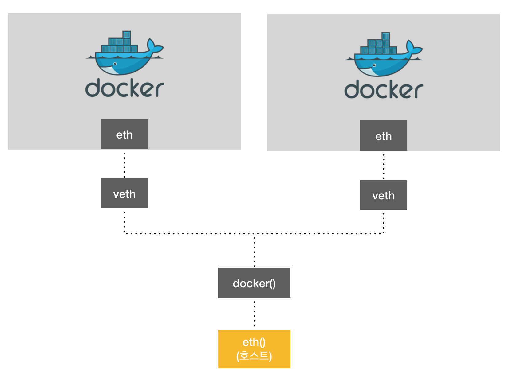

# 설치
```bash
curl -fsSL https://get.docker.com/ | sudo sh
```
# sudo 없이 사용하기
```bash
sudo usermod -aG docker $USER # 현재 접속중인 사용자에게 권한주기
sudo usermod -aG docker your-user # your-user 사용자에게 권한주기
```

# Docker example

```dockerfile
FROM openjdk:8-jdk-alpine
ARG JAR_FILE=target/*.jar
COPY ${JAR_FILE} app.jar
ENTRYPOINT ["java", "-jar", "/app.jar"]
```

```dockerfile
FROM mcr.microsoft.com/dotnet/core/aspnet:3.1
COPY bin/Release/netcoreapp3.1/publish/ App/
WORKDIR /App
ENTRYPOINT ["dotnet", "NetCore.Docker.dll"]
```

```dockerfile
FROM openjdk:11-jdk-slim as builder
COPY . .
WORKDIR /
RUN chmod +x ./gradlew
RUN ./gradlew bootjar

FROM openjdk:11-jre-slim
COPY --from=builder build/libs/*.jar app.jar
ENTRYPOINT ["java", "-jar", "/app.jar"]
```
> 통으로 복사해서 gradle빌드 하는 방법

- FROM 키워드: 정규화된 Docker 컨테이너 이미지 이름
- COPY: 지정된 폴더를 컨테이너의 폴더에 복사
- WORKDIR: 컨테이너 내부의 현재 디렉터리를 App으로 변경
- ENTRYPOINT: 테이너가 실행 파일로 실행되게 컨테이너를 구성하


## dockerfile build
- docker build --build-arg JAR_FILE=build/libs/*.jar -t 이미지명 .

| 옵션  | 설명                                                        |
| ----- | ---------------------------------------------------------- |
| --force-rm=false  | 이미지 생성에 실패했을 때도 임시 컨테이너를 삭제                    |
| -no-cache=false    | 이전 빌드에서 생성된 캐ㅣ를 사용하지 않음. 도커는 이미지 생성 시간을 줄이기 위해 각 과정을 캐시함. |
| -q, --quiet=false |  RUN의 실행 출력 결과를 표시하지 않음 |
| --rm=true | 이미지 생성에 성공했을 때 임시 컨테이너를 삭제 |
| -t, --tag="" | 저잣오 이름, 이미지 이름, 태그를 설정 <저장소 이름>/<이미지 이름>:<태그> |

## 이미지->컨테이너
- docker run -d -p 80:8080 --name 컨테이너명 이미지명


- docker run [OPTIONS] IMAGE[:TAG|@DIGEST] [COMMAND] [ARG....]

| 옵션  | 설명                                                        |
| ----- | ---------------------------------------------------------- |
| -d    | detached mode 흔히 말하는 백그라운드 모드                    |
| -p    | 호스트와 컨테이너의 포트를 연결 (포워딩)                      |
| -v    | 호스트와 컨테이너의 디렉토리를 연결 (마운트)                  |
| -e    | 컨테이너 내에서 사용할 환경변수 설정                         |
| –-name | 컨테이너 이름 설정                                          |
| –rm   | 프로세스 종료시 컨테이너 자동 제거                           |
| -i   | 표준입력(stdin)을 활성화 및 컨테이너 연결 없이도 표준입력 유지  |
| -t   | Bash 사용을 위한 명령어 셀 표시를 위해서 사용함.               |
| -it   | -i와 -t를 동시에 사용한 것으로 터미널 입력을 위한 옵션        |
| –link | 컨테이너 연결 [컨테이너명:별칭]                              |
| –cap-add | cgroups얻는 것                                          |


## 실행/종료
- docker start 컨테이너명
- docker stop 컨테이너명
-  `전부 종료 : docker stop $(docker ps -a -q)`

## 연결
- docker exec -it 컨테이너명 실행할프로세스
- docker attach 컨테이너명

## 이미지 목록
- docker images

## 컨테이너 목록
- docker ps -a

## 컨테이너 삭제
- docker rm 컨테이너명

## Docker 로그인
- docker login -U 

## Docker Hub에 push/pull
- docker push 이미지명
- docker pull 이미지명

## Docker Compose

## Docker Network
- 컨테이너는 내부 IP를 순차적으로 할당을 하며, 컨테이너가 재시작 될 때마다 변경 될 수 있다.
- 만약 외부와 연결해야 할 경우 호스트에 **veth(=virtual eth)** 라는  네트워크 인터페이스를 생성하고 컨테이너의 eth와 연결이 됨
- veth 인터페이스는 사용자가 직접 생성할 필요 없이 도커엔진에 의해 자동으로 생성 됨
- veth 인터페이스 뿜남 아니라 **docker()** 라는 브릿지도 있는데 이는 veth인터페이스와 바인딩 되어 호스트의 eth 인터페이스와 연결해줌
- docker run --net=NETWORK_TYPE .....


### 도커에서 제공하는 네트워크 드라이버는 **bridge, host, none, container, overlay** 가 있음

  ### bridge
  - 사용자가 정의한 브릿지를 생성해 각 컨테이너에 연결하는 네트워크 구조로 컨테이너는 연결 된 브릿지를 통해 외부와 통신할 수 있음
  ```
  > docker network create --driver=bridge -subnet=172.19.0.0/16 [브릿지 이름]
  ```
  > 도커 내부에서 172.19.0.~ 대역대를 사용할 수 있는 네트워크 생성
  > docker run 또는 docker create 명령어에서 --net 옵션으로 커스텀 브릿지를 사용할 수 있음
  ```
  > docker run -i -t --name my_container --net my_bridge ubuntu:14.04
  ```
  
  ### host
  - 호스트의 네트워크 환경을 그대로 사용 함


네트워크 정보 보기
```
> docker network inspect [네트워크 이름]
```

> 기본적으로 생성되는 컨테이너는 bridge임

> 컨테이너를 생성하고 bridge 네트워크 정보를 보니 내가 만든 컨테이너 목록이 들어 있었음.

> 실행 될 떄마다 컨테이너에 할당 되는 ip가 변경 됨 -> 고정하는 법 알아야 할 듯
> - **docker run --net {네트워크} --ip {ip} {container}**

> docker exec -it {컨테이너} route 로 확인하면 게이트웨이인 docker0으로 나가는걸 확인 할 수 있음


  
  
 
 ### 오류
 - WSL2 환경에서 사용하고 있었는데 Docker가 없데이트 되고부터는 docker daemon이 실행중이 아니라고 작동 되지 않았다.
 - ubuntu 지우고 다시 설치하니까 되더라...
 - root passwd 초기화 하기 위해 기본 로그인을 root로 변경 해야 함. **ubuntu1804.exe config --default-user root** 이후 리눅스 접속후 passwd
 - docker를 sudo 없이 사용하기 위해 유저를 도커 그룹에 추가해준다.  **> sudo usermod -aG docker $USER**
